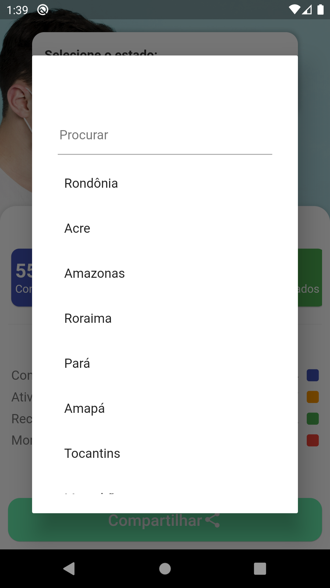
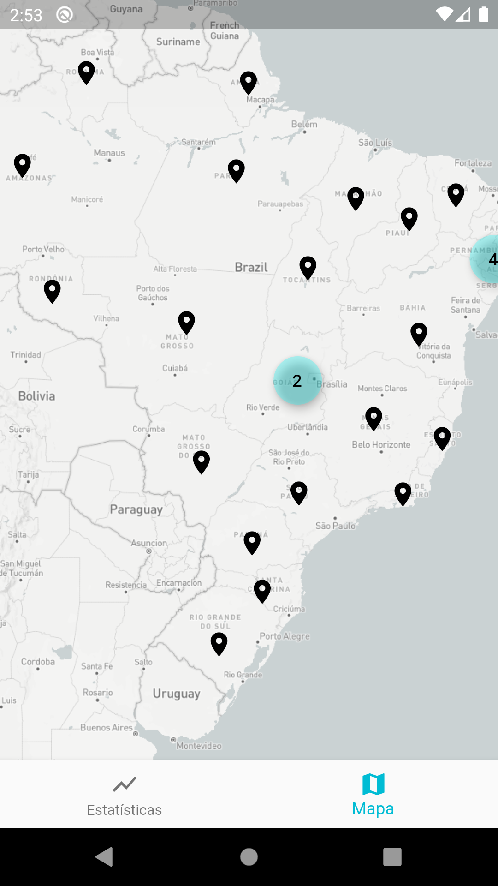

# COVID-19 Estatísticas

Esse aplictivo tem o intuito de ajudar todos a acompanhar as estastítiscas do COVID-19 nos estados brasileiros e no Brasil como todo.

|                             |                             |                             |
| :-------------------------- | :-------------------------: | :-------------------------: |
|  |  |  |
|                             |                             |                             |

## Nota!

Eu comecei a desenvolver esta aplicação de última hora enquanto me sentia bastante mal com supeitas de ter contraído o vírus e acabei adiadando a ida ao hospital para publicar algo funcional e ajudar a todos. Mas no momento atual eu já fui ao hospital, tomei a devida medição e até agora fui constatado como descartado.

## Download

Você pode baixar os instaladores atráves das [releases](https://github.com/robsonsilv4/covid19_statistics/releases). Não se preocupe, pode instalar e compartilhar sem problemas, não há nada de malicioso e você pode conferir no código. Lançarei na PlayStore assim que possível, no momento as informações são mais importantes.

## Como rodar o projeto

Primeiro você precisa clonar o repositório:

```sh
git clone https://github.com/robsonsilv4/queroworkar.git covid19_statics
```

Agora basta entrar na pasta do projeto e baixar os pacotes:

```sh
cd covid19_statics

flutter packages get
```

E rodar no seu dispositivo:

```sh
flutter run
```

## Como gerar o instalador

Para gerar os instaladores, basta entrar na pasta do projeto e rodar o seguinte comando:

```sh
flutter build apk --split-per-abi

flutter install # para instalar no dispositivo ou emulador
```

Os arquivos gerados ficam em:

```sh
covid19_statics/build/app/outputs/apk/release/...
```

---

### Tecnologias e pacotes utilizados:

- [Dart](https://dart.dev/) como linguagem principal.
- [Flutter](https://flutter.dev/) como framework cross plataform.
- [Dio](https://github.com/flutterchina/dio) para requisição web.
- [MobX](https://github.com/mobxjs/mobx.dart) para gerenciamento de estado.
- [Flutter MobX](https://pub.dev/packages/flutter_mobx) para utilização do Observer junto aos widgets.
- [MobX Code Gen](https://pub.dev/packages/mobx_codegen) para geração dos stores.g.
- [Build Runner](https://github.com/dart-lang/build) para geração de código.
- [Find Dropdown](https://github.com/davidsdearaujo/find_dropdown) para seleção dos estados.

---

## Como contribuir

Você pode contribuir para o projeto de qualquer maneira. Seja instalado o aplicativo e dando feedback, abrindo issues, melhorando ou trauduzindo a documentação, melhorando ou adicionando features, compartilhando ou falando sobre o projeto, doando ou de qualquer outra forma que conseguir. O importante é que essas informações cheguem a todos e que possamos passar por esse momento da melhor maneira possível.

---

## Contribuidores

Desenvolvido incialmente por [Robson Silva](https://github.com/robsonsilv4) com a ajuda dos seguintes [contribuidores](./CONTRIBUTORS.md).

---

## Agredecimentos e créditos

Agredicimentos em especial e créditos ao [Arthur Ribeiro](https://github.com/devarthurribeiro), já que sem a [API](https://github.com/devarthurribeiro/covid19-brazil-api) disponiblizada por ele essa aplicação não seria possivel.

---

## Licença

A licença utilizado no projeto é a MIT. Para mais detalhes leia o [arquivo](./LICENSE.md).
